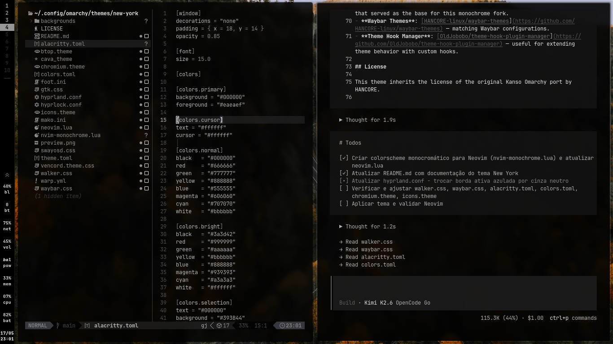

# New York

A monochrome Omarchy theme based on the [Kanso theme for Omarchy](https://github.com/HANCORE-linux/omarchy-kanso-theme) by [HANCORE Linux](https://github.com/HANCORE-linux).

<b>Original Kanso theme:</b> [HANCORE-linux/omarchy-kanso-theme](https://github.com/HANCORE-linux/omarchy-kanso-theme)

## Overview

New York is a **monochromatic** color scheme designed for deep focus and minimal visual noise. Moving away from the traditional blue-gray accents, this theme embraces pure black (`#000000`) backgrounds with a carefully crafted grayscale foreground palette.

## Color Palette

| Role | Color | Hex |
|------|-------|-----|
| Background | Pure Black | `#000000` |
| Foreground | Light Gray | `#C5C9C7` |
| Selection | Dark Gray | `#393B44` |
| Cursor | Light Gray | `#C5C9C7` |
| Border Active | Gray | `#43464E` |
| Border Inactive | Black | `#000000` |

### ANSI Colors (Grayscale)

```
Normal:  #000000, #666666, #777777, #888888, #555555, #606060, #707070, #bbbbbb
Bright:  #3a3d42, #999999, #aaaaaa, #bbbbbb, #888888, #939393, #a3a3a3, #ffffff
```

## Supported Applications

This theme provides consistent styling across the entire Omarchy desktop environment:

- **Alacritty** — Terminal emulator
- **Foot** — Wayland terminal
- **Neovim** — Custom `omarchy-mono` colorscheme (monochrome, no colored syntax highlighting)
- **Zed** — Full editor theme with 5 variants (Omarchy, Kanso Ink, Kanso Mist, Kanso Pearl, Kanso Zen)
- **Walker** — Application launcher
- **Waybar** — Status bar
- **Hyprland** — Window manager (borders, gaps, shadows, animations)
- **Hyprlock** — Lock screen
- **Mako** — Notification daemon
- **SwayOSD** — On-screen display
- **GTK** — Application theming
- **Btop** — System resource monitor
- **Cava** — Audio visualizer
- **Discord (Vencord)** — Custom CSS theme
- **Warp** — Terminal theme
- **Chromium** — Browser frame color
- **Yazi** — File manager (via `theme.toml`)

## Preview




*A clean, monochrome desktop with pure black tones and grayscale accents.*

## Installation

#### Using `omarchy-theme-install`:

```bash
omarchy-theme-install https://github.com/HANCORE-linux/omarchy-new-york-theme.git
```

Or manually copy this directory to:

```
~/.config/omarchy/themes/new-york/
```

Then activate with:

```bash
omarchy theme set "new-york"
```

## Project Links

- **Base theme:** [HANCORE-linux/omarchy-kanso-theme](https://github.com/HANCORE-linux/omarchy-kanso-theme) — the original Kanso theme port for Omarchy
- - **Omarchy:** [omarchy.org](https://omarchy.org/)

## Credits

- **HANCORE Linux:** [GitHub](https://github.com/HANCORE-linux)
- Built for [Omarchy](https://omarchy.org/) — a beautiful, modern Arch Linux distribution with Hyprland

## License

See [LICENSE](LICENSE) for details.
